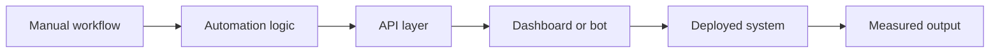

<picture>
  <source media="(prefers-color-scheme: dark)" srcset="https://readme-typing-svg.demolab.com?font=JetBrains+Mono&weight=700&size=22&duration=2600&pause=700&color=67E8F9&center=true&vCenter=true&width=900&height=45&lines=I+turn+manual+work+into+reliable+systems.;Bots%2C+APIs%2C+dashboards%2C+deployments.;Built+for+speed.+Structured+for+scale.">
  <source media="(prefers-color-scheme: light)" srcset="https://readme-typing-svg.demolab.com?font=JetBrains+Mono&weight=700&size=22&duration=2600&pause=700&color=0E7490&center=true&vCenter=true&width=900&height=45&lines=I+turn+manual+work+into+reliable+systems.;Bots%2C+APIs%2C+dashboards%2C+deployments.;Built+for+speed.+Structured+for+scale.">
  
</picture>

 

  

---

## Mission

> I design small, sharp software systems that replace repetitive work with dependable automation.

<table>
  <tr>
    <td width="33%">
      <h3>Input</h3>
      
Messy workflows, repeated tasks, disconnected tools, slow handoffs, fragile deployments.

    </td>
    <td width="33%">
      <h3>Process</h3>
      
Map the system, remove waste, connect APIs, automate the boring parts, ship a clean interface.

    </td>
    <td width="33%">
      <h3>Output</h3>
      
Bots, dashboards, services, scripts, deployments, and integrations that keep working.

    </td>
  </tr>
</table>

## Systems

<table>
  <tr>
    <td width="50%">
      <h3>Automation Lab</h3>
      
<strong>What I build:</strong> bots, schedulers, background jobs, data workflows, notification engines.

      
<strong>Why it matters:</strong> teams should not repeat tasks that software can run accurately.

    </td>
    <td width="50%">
      <h3>Product Engine</h3>
      
<strong>What I build:</strong> web apps, dashboards, admin panels, REST APIs, database-backed tools.

      
<strong>Why it matters:</strong> useful software needs clean UX, stable backend logic, and fast iteration.

    </td>
  </tr>
  <tr>
    <td width="50%">
      <h3>Integration Core</h3>
      
<strong>What I build:</strong> service connectors, payment flows, webhook systems, API orchestration.

      
<strong>Why it matters:</strong> disconnected tools create hidden operational cost.

    </td>
    <td width="50%">
      <h3>Deploy Layer</h3>
      
<strong>What I build:</strong> Linux/VPS setups, Nginx configs, Dockerized services, backup paths.

      
<strong>Why it matters:</strong> a project is not finished until it can run reliably outside the laptop.

    </td>
  </tr>
</table>

## Stack

<table>
  <tr>
    <td align="center"><strong>Languages</strong></td>
    <td align="center"></td>
  </tr>
  <tr>
    <td align="center"><strong>Frameworks</strong></td>
    <td align="center"></td>
  </tr>
  <tr>
    <td align="center"><strong>Data</strong></td>
    <td align="center"></td>
  </tr>
  <tr>
    <td align="center"><strong>Ops</strong></td>
    <td align="center"></td>
  </tr>
</table>

## Operating Principles

| Rule | Standard |
|:--|:--|
| Automate the repeatable | If the workflow repeats, design a system around it. |
| Keep the interface clean | Complexity belongs behind clear commands, APIs, and dashboards. |
| Ship with operations in mind | Deployment, logs, recovery, and maintenance are part of the build. |
| Optimize for useful speed | Move fast, but keep the codebase readable enough to keep moving later. |

## Signal

<picture>
  <source media="(prefers-color-scheme: dark)" srcset="https://github-readme-stats.vercel.app/api?username=daneil-k&show_icons=true&hide_border=true&rank_icon=github&include_all_commits=true&count_private=true&theme=transparent&title_color=a3e635&text_color=e5e7eb&icon_color=67e8f9">
  <source media="(prefers-color-scheme: light)" srcset="https://github-readme-stats.vercel.app/api?username=daneil-k&show_icons=true&hide_border=true&rank_icon=github&include_all_commits=true&count_private=true&theme=transparent&title_color=4d7c0f&text_color=020617&icon_color=0e7490">
  
</picture>

<picture>
  <source media="(prefers-color-scheme: dark)" srcset="https://github-readme-stats.vercel.app/api/top-langs/?username=daneil-k&layout=compact&hide_border=true&langs_count=8&theme=transparent&title_color=a3e635&text_color=e5e7eb">
  <source media="(prefers-color-scheme: light)" srcset="https://github-readme-stats.vercel.app/api/top-langs/?username=daneil-k&layout=compact&hide_border=true&langs_count=8&theme=transparent&title_color=4d7c0f&text_color=020617">
  
</picture>

 

<picture>
  <source media="(prefers-color-scheme: dark)" srcset="https://github-readme-activity-graph.vercel.app/graph?username=daneil-k&hide_border=true&bg_color=00000000&color=e5e7eb&line=a3e635&point=67e8f9&area=true&area_color=0e7490&custom_title=Build%20Signal">
  <source media="(prefers-color-scheme: light)" srcset="https://github-readme-activity-graph.vercel.app/graph?username=daneil-k&hide_border=true&bg_color=ffffff&color=020617&line=4d7c0f&point=0e7490&area=true&area_color=a3e635&custom_title=Build%20Signal">
  
</picture>

  
<strong>Open the trophy wall</strong>

   
  

    <picture>
      <source media="(prefers-color-scheme: dark)" srcset="https://github-profile-trophy.vercel.app/?username=daneil-k&theme=algolia&no-frame=true&no-bg=true&margin-w=12&column=7">
      <source media="(prefers-color-scheme: light)" srcset="https://github-profile-trophy.vercel.app/?username=daneil-k&theme=flat&no-frame=true&no-bg=true&margin-w=12&column=7">
      
    </picture>
  

## Contact

<table>
  <tr>
    <td align="center">
      <h3>Build request?</h3>
      
Automation, web systems, APIs, VPS deployments, and infrastructure tooling.

      
      
    </td>
  </tr>
</table>

Designed to be direct, technical, and useful. No noise. Just systems that work.

